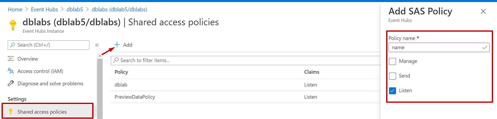

# NoSql_labs

1.Для виконання лабораторної роботи потрібно бути зареєстрованим на Порталі Microsoft Azure  та мати створену підписку.

2.Створюємо ресурс групу:

* вибираєм нашу підписку, задаєм ім’я групі та вибираєм регіон, який розташований найблище до нас. Нажимаєм create

3. Додаємо Redis Cache:

* Щоб створити Redis Cache вибираємо підписку,створену раніше ресурс групу,задаєм DNS ім'я, вибираєм ту ж локацію що і раніше. Обираєм cache type та нажимаєм create

4.Створюєм Event Hub

* Створюємо Event Hubs Namespace 

* Вибираєм нашу підписку, ресурс групу, задаєм унікальне ім’я та вибираємо регіон. Нажимаєм create

* Переходим в namespace і створюєм інстанс івен хабу:

5. Переходим в створений EVENT HUB та створюєм  Shared Access Policy для генерації Primary Key і Connection string–primary key. Вибираєм Listen.

6. Вставляєм створений ключ і стрінгу у файл lab5_nosql/src/main/java/ua/iot/nosql/EventHub.java у відповідні поля:  
SAS_KEY_NAME та SAS_KEY 
Також вписуєм назви NAMESPACE_NAME та EVENT_HUB_NAME.

7. Переходим в Azure Cache for Redis , тоді в Access keys , де згенеровані Primary connection string та Primary key . 

 Відкриваєм файл NoSql_labs/lab5_nosql/src/main/java/ua/iot/nosql/Console.java і записуєм ці дані у відповідні поля CACHE_HOSTNAME і CACHE_KEY.

8. Для того щоб завантажити дані запускаєм головний клас MainApp.java і обираєм стратегію :

 9. Перевіряєм чи дані завантажились:

* В Azure Cache for Redis переходим в Console та вводим команду hgetAll Console

* Заходим в Event hub і бачимо реквести.

