# NoSql_lab6
Заходим в gcp console. Створюємо новий проект. Переходим в Compute Engine , тоді в VM instances та створюєм нову віртуальну машину:
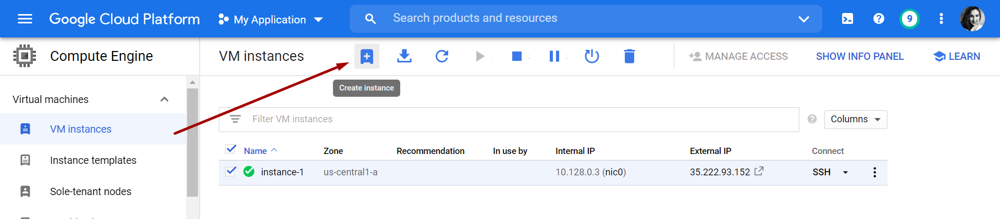
Вибираєм операційну систему Ubuntu, та дозволяєм HTTP, HTTPS трафік та нажимаєм create.
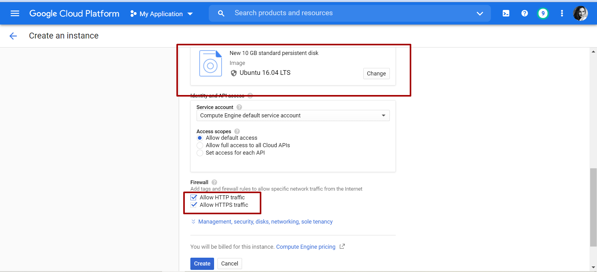
Після створення переходимо в Details -> Network interfaces -> View details. 
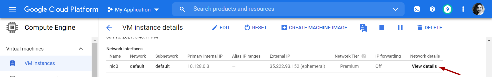
Потім в Firewall -> Create Firewall rule
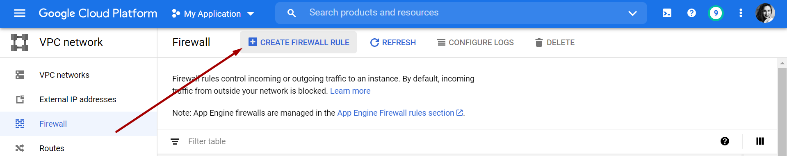
Потрібно додати Elasticsearch та Kibana з діапазоном IP, встановленим на 0.0.0.0/0, а протоколи TCP встановлені на 9200 для Elasticsearch та 5601 для Kibana.
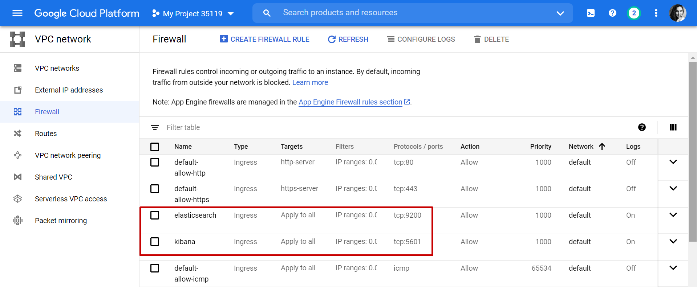
Підключаємось до віртуальної машини через SSH-з'єднання. Тут інсталялюємо Java, Elasticsearch, Logstash та Kibana.
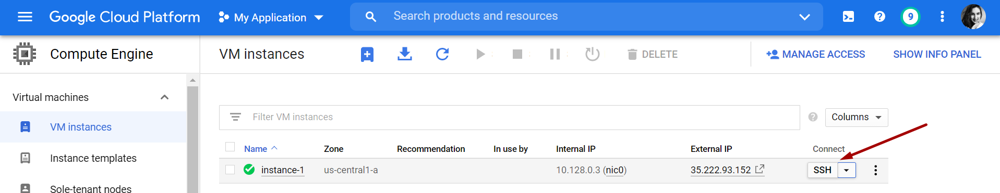
Використовуюєм  наступні набори команд:

1.Install Java

`sudo apt-get install default-jre`

2.Install Elasticsearch

`sudo apt update`

`sudo apt install apt-transport-https`

`wget -qO - https://artifacts.elastic.co/GPG-KEY-elasticsearch | sudo apt-key add -`

`sudo sh -c 'echo "deb https://artifacts.elastic.co/packages/7.x/apt stable main" > /etc/apt/sources.list.d/elastic-7.x.list'`

`sudo apt update`

`sudo apt install elasticsearch`

`sudo service elasticsearch status`

`sudo systemctl enable elasticsearch.service`

`sudo systemctl start elasticsearch.service`

`curl -X GET "localhost:9200/"`

`sudo nano /etc/elasticsearch/elasticsearch.yml`

Розпакуйте файл і розкоментуйте рядок network.host( вставте адресу: network.host: 0.0.0.0) та рядок discovery.seed_hosts: []. Збережіть файл.

`sudo service elasticsearch restart`

3.Install Logstash

`sudo apt-get install apt-transport-https`

`echo "deb https://artifacts.elastic.co/packages/5.x/apt stable main" | sudo tee -a /etc/apt/sources.list.d/elastic-5.x.list`

`sudo apt-get update`

`sudo apt-get install logstash`

`sudo service logstash start`

4.Install Kibana

`echo "deb http://packages.elastic.co/kibana/7.0/debian stable main" | sudo tee -a /etc/apt/sources.list.d/kibana-7.0.x.list`
`
sudo wget --directory-prefix=/opt/ https://artifacts.elastic.co/downloads/kibana/kibana-7.6.1-amd64.deb`

`sudo dpkg -i /opt/kibana*.debv\`

`sudo apt-get update`

`sudo apt-get install kibana`

`sudo nano /etc/kibana/kibana.yml`

#Розпакуйте файл і розкоментуйте рядок та пропишіть дані: server.port: 5601 та server.host: "0.0.0.0" . Збережіть файл.

`sudo service kibana start`

Якщо все працює,то переходим по  External IP-адресу сервера із зазначеним портом 9200 та 5601
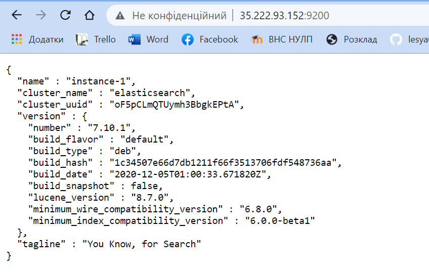
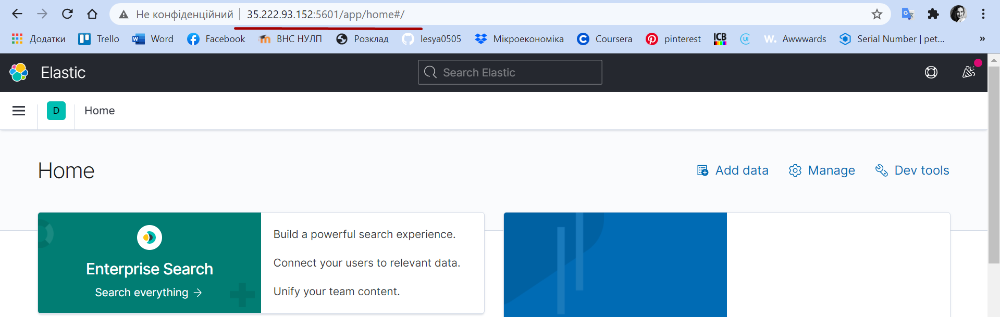

Переходимо в microsoft azure portal та створюємо Logic App
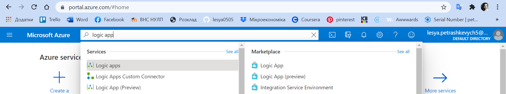
Переходимо створену Logic App -> Logic app designer
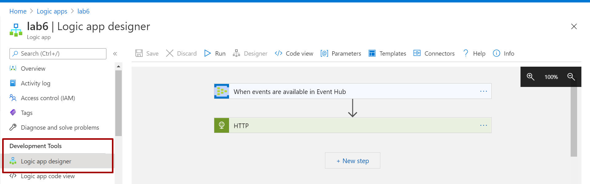
Налаштовуєм наступним чином :
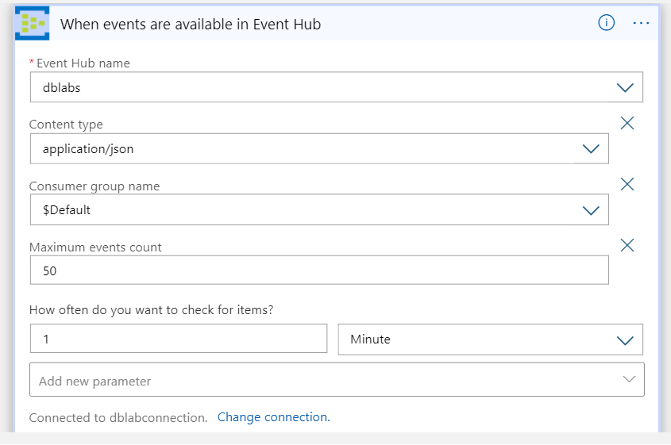
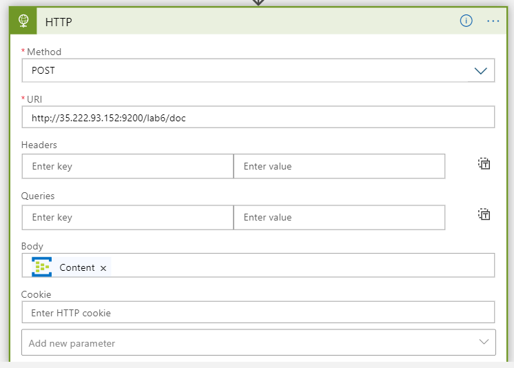

Переходим в джава аплікацію створену в 5 лабі, запускаєм код та надсилаєм дані в івент хаб. Тоді запускаєм тригер.
Дані відобразяться у веб-інтерфейсі Kibana. 
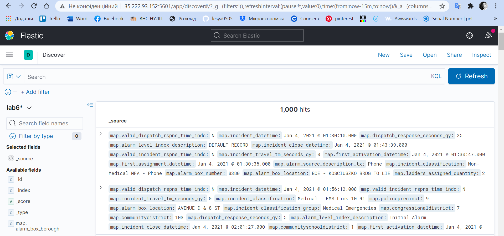
