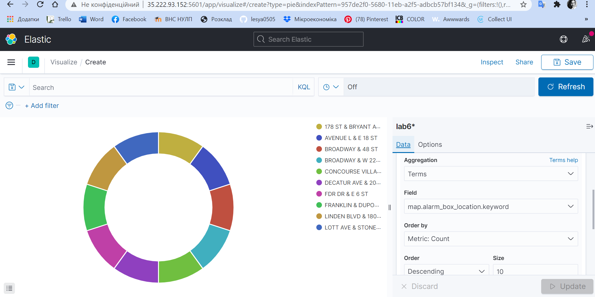
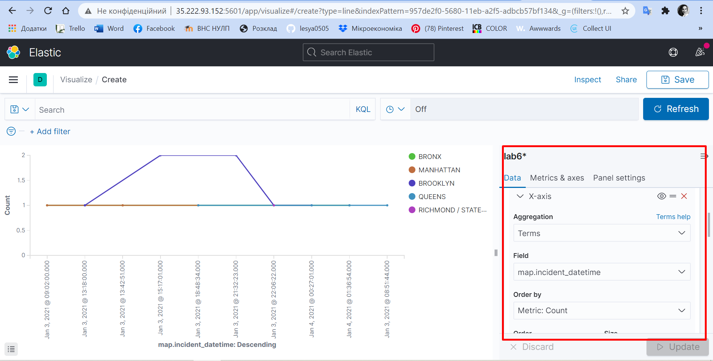
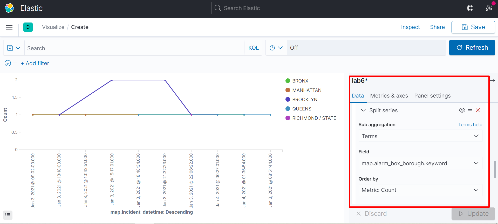
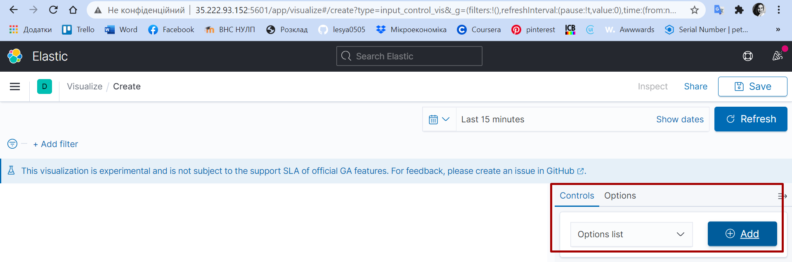
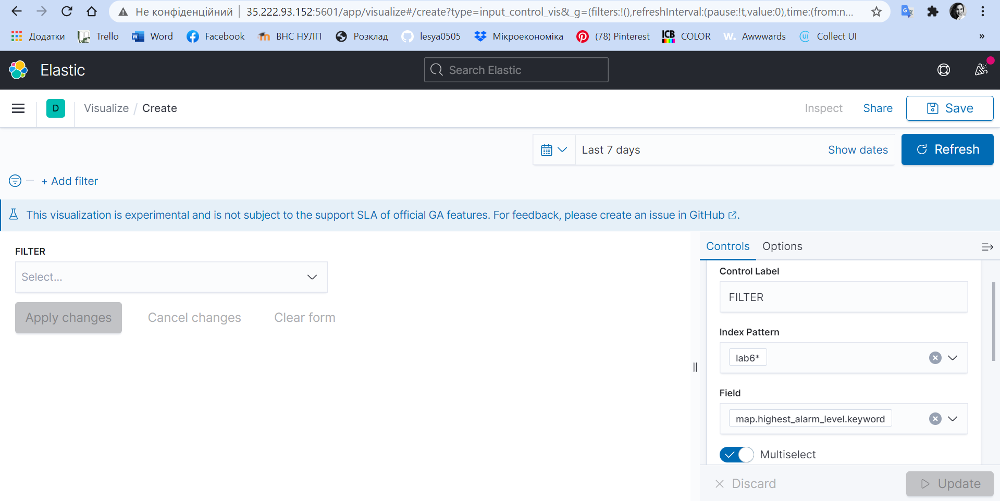
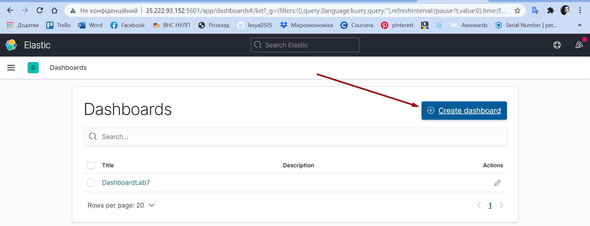
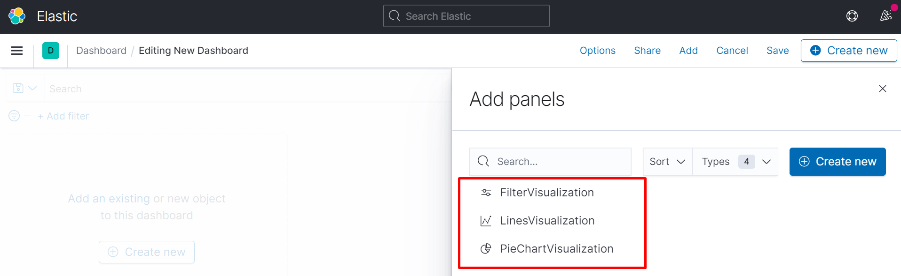
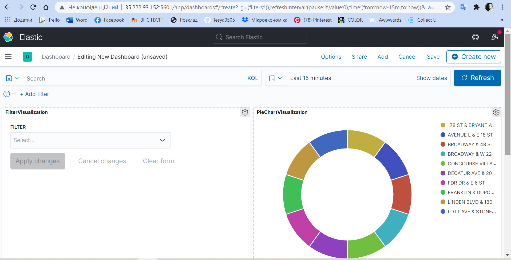
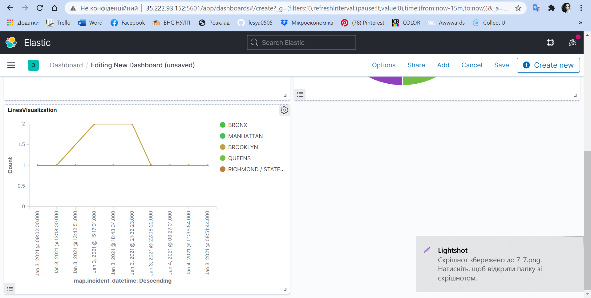
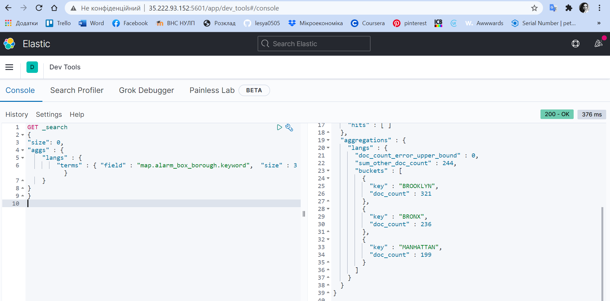

# NoSql_lab7
Переходимо в Kibana -> Visualization, та створюєм наступні репорти:

1. Створюємо Pie Chart Visualization : Create visualizations -> Pie
При створенні потрібно додати bucket, обрати split series, в полі Aggregation вибрати Terms, в полі Fields вказуєм наші дані, які відображатимуться, та обираємо розмір даних

2. Створюємо Lines Visualization : Create visualizations -> Line
Додаємо bucket, обираємо x-asis, в полі Aggregation вибрати Terms, в полі Fields вказуєм часові дані, та задаєм розмір.

Додаємо ще один  bucket, обираємо split series, в полі Aggregation вибрати Terms, в полі Fields вказуєм дані для відображення, та задаєм розмір. Так ми отримаєм динаміка  кількості записів по днях за певним полем.

3. Створюємо Controls Visualization : Create visualizations -> Controls
Вибираєм options list на нажимаєм Add

Вводим наступні параметри.

4. Створюємо Dashboards, де відображатимуться наші візуалізації:

5.Переходим в Kibana Dev Tools для написання запитів :
Щоб сформувати топ-3 records за обраним полем прописуєм наступний код:

`GET _search
{
"size": 0,
"aggs" : {
    "langs" : {
        "terms" : { "field" : "map.alarm_box_number.keyword",  "size" : 3 }
    }
}}
`

