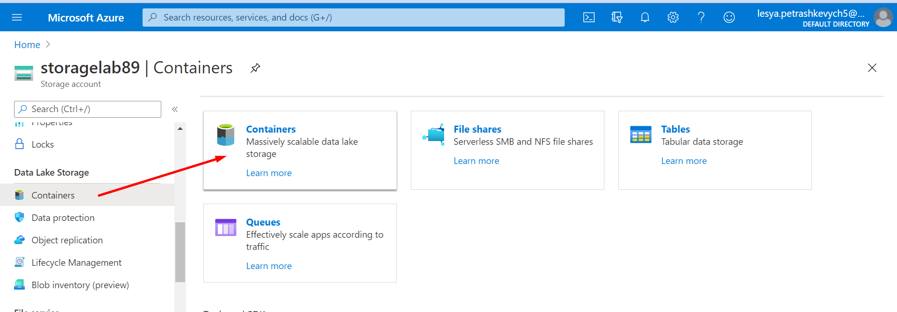
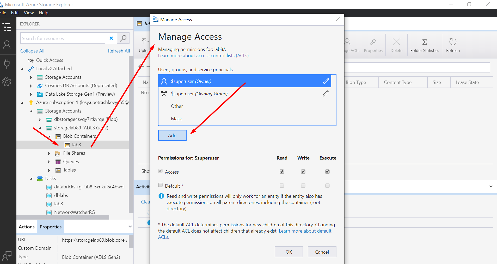
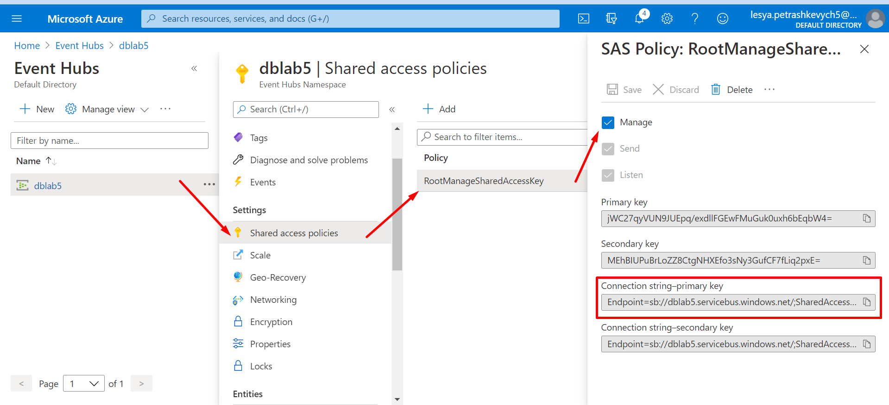

# Lab 8-9

1.Створення DataBricks

Переходимо в microsoft azure portal та створюємо нову ресурс групу :


Тепер переходим до створення DataBricks:


Заповнюєм дані та вибираєм free trial підписку


Тепер ми перейшли на основну сторінку DataBricks. В обираємо Clusters, потім натискаємо на Create Cluster

Заповнюєм дані наступним чином:

В створеному кластері заходимо в Libraries –> Install New –> Maven. Вводимо в Coordinates: com.microsoft.azure:azure-eventhubs-spark_2.12:2.3.18-9


Далі  переходимо у Workspace. Там нам потрібно створити Notebook python file та scala file :


2.Створення Storage account


Обираємо  Replecation – LRS

Після цього переходим в Advanced та обираємо  Hierarchical namespace – Enabled.


3. Створення Azure Active Directory
Для створення аплікації виконуєм наступні кроки:


Заходимо в створений ресурс,переходим  до Certificates & Secrets ->Client Secrets -> New client secret .


Тепер переходим в Storage account та створюємо контейнер :

В в Public Access Level обираємо Container:

Створюємо Access Control та додаємо роль contributor


Тепер необхідно завантажити  програму Microsoft Azure Storage Explorer https://azure.microsoft.com/en-us/features/storage-explorer/

В Data Lake потрібно налаштувати доступ до директорії. 
Переходим в програму, вибираєм створений контейнер, відкриваєм Manage Access Control Lists та виконуєм наступні кроки:




Створюємо нову папку:

Переходим в Manage Access Control Lists та виконуєм наступні кроки:


Тепер повертаємось до кластер DataBricks. Вибираєм Workspace та відкриваєм lab8python та вставляєм наступний код:
```
configs = {"fs.azure.account.auth.type": "OAuth",
           "fs.azure.account.oauth.provider.type": "org.apache.hadoop.fs.azurebfs.oauth2.ClientCredsTokenProvider",
         "fs.azure.account.oauth2.client.id": "f1a6e24a-5040-4a85-91b5-c829c6483417",
         "fs.azure.account.oauth2.client.secret": "q3_s.gIhDoolVv.-0406EetmA_8gGW435i",
         "fs.azure.account.oauth2.client.endpoint": "https://login.microsoftonline.com/eeec81d4-3424-4ef1-adf1-1e785c47d787/oauth2/token",
         "fs.azure.createRemoteFileSystemDuringInitialization": "true"}
dbutils.fs.mount(
source = "abfss://lab8@storagelab89.dfs.core.windows.net/",
mount_point = "/mnt/lab8",
extra_configs = configs)
display(dbutils.fs.ls('/mnt/lab8'))
```


Поля потрібно замінити на свої:

` "fs.azure.account.oauth2.client.id"` на `application (client) id` з апки, яку ми раніше зареєстрували в App registration

`"fs.azure.account.oauth2.client.secret"` на значення `Client Secret Value` 

`"fs.azure.account.oauth2.client.endpoint"` вставляємо Directory (tenant) ID з вкладки Overview.

В `Source` вставляєм назви `storage_container`та `storage_accoun_name` відповідно.

В `mount_point` ми прописуєм назву попередньо створеної папки

Після цього запускаєм код :


Тепер переходим до файлу lab8scala та вставляєм наступний код :
```
import org.apache.spark.eventhubs.{ ConnectionStringBuilder, EventHubsConf, EventPosition }
import org.apache.spark.sql.types._
import org.apache.spark.sql.functions._

val appID = "f1a6e24a-5040-4a85-91b5-c829c6483417"
val password = "q3_s.gIhDoolVv.-0406EetmA_8gGW435i"
val tenantID = "eeec81d4-3424-4ef1-adf1-1e785c47d787"
val fileSystemName = "lab8"
val storageAccountName = "storagelab89"
val connectionString = ConnectionStringBuilder("Endpoint=sb://dblab5.servicebus.windows.net/;SharedAccessKeyName=RootManageSharedAccessKey;SharedAccessKey=jWC27qyVUN9JUEpq/exdllFGEwFMuGuk0uxh6bEqbW4=")
  .setEventHubName("blabs")
  .build
val eventHubsConf = EventHubsConf(connectionString)
  .setStartingPosition(EventPosition.fromEndOfStream)

var streamingInputDF = 
  spark.readStream
    .format("eventhubs")
    .options(eventHubsConf.toMap)
    .load()

val filtered = streamingInputDF.select (
  from_unixtime(col("enqueuedTime").cast(LongType)).alias("enqueuedTime")
     , get_json_object(col("body").cast(StringType), "$.incident_datetime").alias("incident_datetime")
     , get_json_object(col("body").cast(StringType), "$.incident_borough").alias("incident_borough")
     , get_json_object(col("body").cast(StringType), "$.incident_classification").alias("incident_classification")
     , get_json_object(col("body").cast(StringType), "$.incident_close_datetime").alias("incident_close_datetime")
)

filtered.writeStream
  .format("com.databricks.spark.csv")
  .outputMode("append")
  .option("checkpointLocation", "/mnt/lab8/lab8")
  .start("/mnt/lab8/lab8")
```


Замінюєм поля на свої:
`app ID` -`client id`,  `password` - `secret value` , `tenantID` - `Directory ID (tenant ID)`, `fileSystemName` - `container name`, `storageAccountName` - ім'я `storage Account` , `connection string` -  `connection string eventhub space`, `setEventHubName` - `ім'я інстансу eventHub`
Дані в `filtered` заміняєм полями з свого датасету.

Для того щоб створити Connection string–primary key ми виконуэм наступні дії:


Запускаєм скалівський код і в відповідній папці згенеруються дані :


